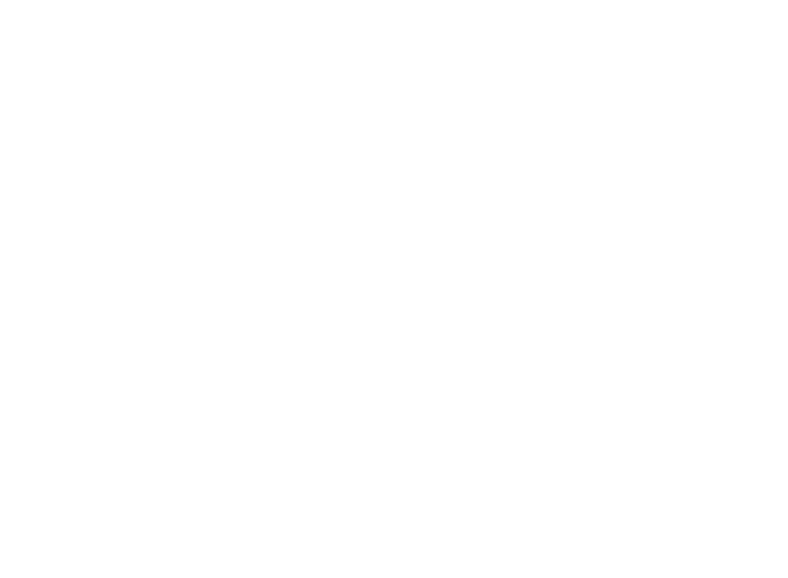

# Repository Introduction
This showcases the resources and approaches I used to learn web development.

Notes starts here:

## HTML
* **HTML** stands for hyper text markup language. 
* It is used to define the structure of contents in the website.
* It has inbuilt elements which helps to specify differnt content types.

### Close tags and Open tags
* **Close tags:** : Tags which needs a closing tag.
    ```
    <h1></h1>
    <p></p>
    ```
* **Open tags** : Tags which doesn't need a closing tag. 
    ```
    <hr/> : used to draw a horizontal line
    <br/> : used to break into new line
    ```

### Heading element
* This element is used to display any text as heading.
* It has values from h1 to h6; where h1 is largest and h6 is smallest
    ```
    <h1>This is heading 1</h1>
    <h2>This is heading 2</h1>
    .
    .
    .
    <h6>This is heading 6<h6/>
    ``` 

### Paragraph element
* Used to define any content as a paragraph.
* Usually used when need to display a large amount of content.
    ```
    <p>This is a pragraph element</p>
    ```

### List element
* Used to display a list of value or items.
* We have two types of list elements.
    1. **Ordered list** : Display the list items with numeral, roman numeral, or alphabets
        ```
        <ol>
            <li> item1 </li>
            <li> item2 </li>
            <li> item3 </li>
        </ol>
        ```
    2. **Unorder list** : Display the list items with bullet, square, disc, or circles
        ```
        <ul>
            <li> item1 </li>
            <li> item2 </li>
            <li> item3 </li>
        </ul>
        ```
### Anchor Element
* Used to add links to the website. 
* Uses attribute **href**.

    Attributes - Extra information about the tag.

    ```
    <a href="https://www.google.com/"> This is a link</a>
    ```

### Image Element
* Used to add images in our website.
* Uses attribute **src**.
* Other commonly used attributes are: alt, height, width
    * alt - Used to give an alternate text for visual impairment peopel. Hence describing the image.
    * height - To set the height of the image.
    * width - To set the width of the image.

        ```
        
        ```

### HTML FORMS
* Are used to make forms in our site which can be filled by user.
* Used to build forms like: Hotel booking, airplane booking, railway booking 
* Below is a simple login form
    ```
    <form action="\login" method="POST">

        <label for="email"> Email </label>
        <input type="text" name="email" required>
        
        <label for="password"> Password </label>
        <input type="text" name="password" required>
        
        <input type="submit" value="Submit">

    </form>
    ```

### File paths
* File paths is an important concept as it helps to define where the file is located
* We categorize file paths into 2 categories
    1. Absolute file path
        * Provides the full path to the file            
            >X:/folder1/project/project1/file1.txt

    2. Relative file path
        * Can be used to access files which are in previous directory
            >../project/project1/file1.txt

        * Can be also be used to access the file in current directory
            >./file1.txt

## CSS
1. Stands for **Cascading Style Sheet**
2. Used for styling and making our site more attractive to users

### Adding CSS

1. Inline - Same line as of html tag

    ```
    <html style = "background:blue" ></html> 
    ```
2. Internal - Use style tag and enclose the CSS code inside it

    ```
    <style>
        body{
            background: red;
        }
    </style>
    ```
3. External - Create a Styles CSS file and link to the html file
    ```
    <head>
        <link rel = "stylesheet" href = "styles.css">
    </head>
    ``` 

### Selectors

1) Element selector
    ```
    h2{
        color:red;
    }
    ```

2) Class selector
    ```
    .red-heading{
        color:red;
    }
    ```

3) Id selector
    ```
    #nav{
        color:red
    }
    ```

4) Attribute selector
    ```
    p[draggable]{
        color:red
    }
    ```

5) Universal selector
    ```
    *{
        color:red
    }
    ```

### CSS colors 

1) Hex code     -   ```000000 to ffffff```
2) RGB          -   ```(0,0,0) to (255,255,255)```
3) RGBa         -   'a' is for opacity
4) HSL          -   Hue saturation lightness ```(0, 0, 0)```
5) HSLa         -   ```'a' is for opacity```


### Units
* 1px - 1/96th inch
* 1pt - 1/72nd inch  
* 1em - 100% of parent
* 1rem - 100% of root

### Box-Model



### Combining selectors
1) Group 
    ```
    selector, selector{
        color: violet;
    }
    ```

2) Child 
    ```
    selector > selector {
        color: red;
    }
    ```
3) Descendant
    ```
    selector selector{
        color: blue;
    }
    ```

4) Chaining
    ```
    selectorselector{
        color: green;
    }
    ```
5) Combining combiners
    ```
    selector selectorselector{
        font-size: 0.5rem;
    }
    ```

### Positioning
1) **Static** : default position
2) **Relative** : positioning relative to default position
3) **Absolute** : positon relative to nearest positioned ancestor
4) **Fixed** : Get fixed and doesn't move even if scrolled

> Note: Z-index is used to set the position of an element below or above other element

### CSS display
1) **Inline**: Takes only needeed.
2) **Block**: Takes the whole width.
3) **Inline-block**: Allow us to set width and height and also keep it in Inline.
4) **None**: Disapper the element

### Float
1. Wrapping text using float and clear
    ```
    img{
        float: right;
    }
    ```
2. To clear the float from the footer type
    ```
    footer{
        float: clear;
    }
    ```

### Responsive website
There are 4 ways:
1) Media queries
2) CSS flexbox
3) CSS grid
4) External frameworks eg: bootstrap

#### Media Queries

* Adding breakpoints for differnet devices to define responsive layouts
    ```
    div{
        background-color: red;
        height:200px;
        width:200px;
    }

    @media (max-width: 600px){
        div{
            height:100px;
            wifth:100px
        }
    }
    ```

#### CSS Flexbox
* Best for when we need to make any in one-dimensional responsive such as nav bar
    ```
    .container{
        display: flex;
        gap:10px;
        flex-direction: row;
        flex-basis: 100px;
    }
    ```

#### CSS Grid
* Best for two dimensional layout 
```
.container{
    display : grid;
    grid-template-columns: 1fr 2fr;
    grid-template-rows: 1fr 1fr;
    gap:10px;
}
```

#### Bootstrap / CSS framework

* Has pre-made CSS tags and can be just copied to our project

